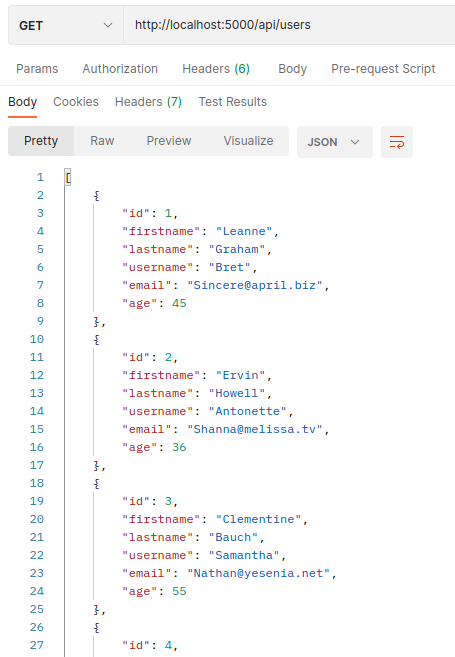
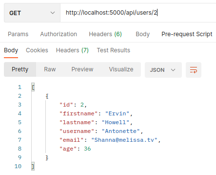
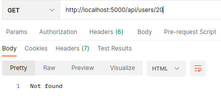
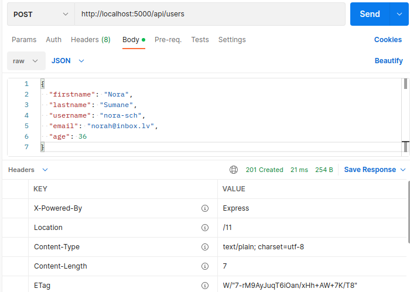
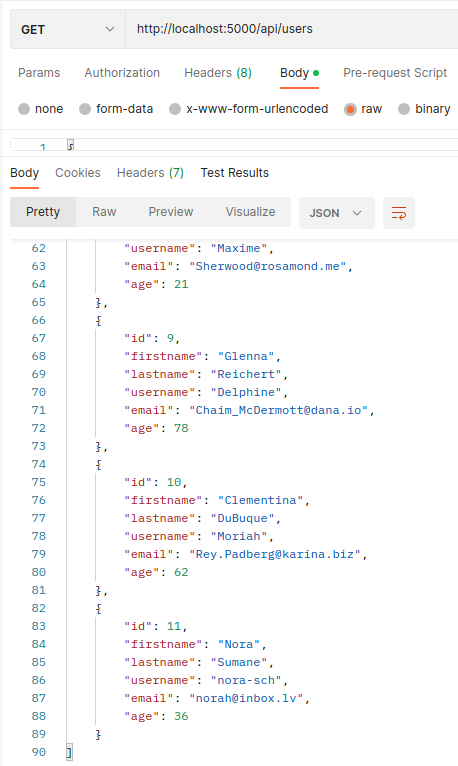
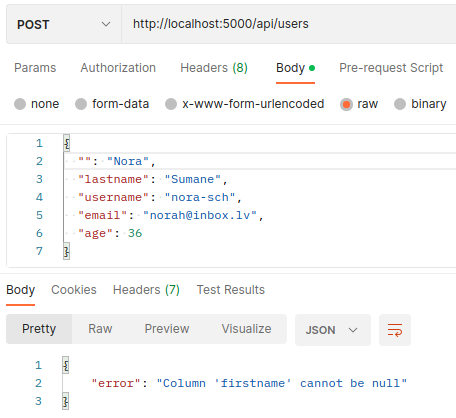
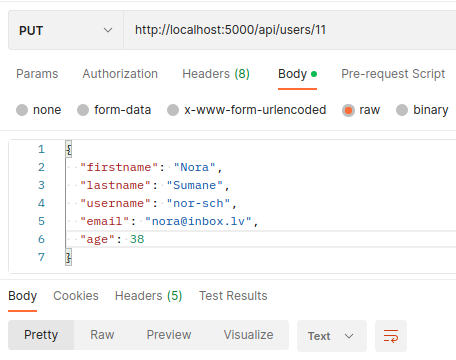
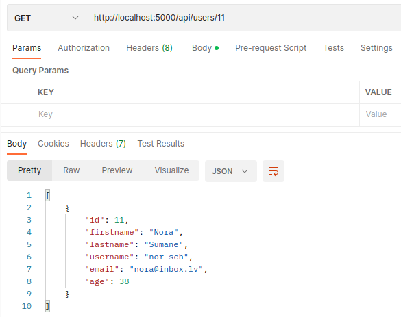
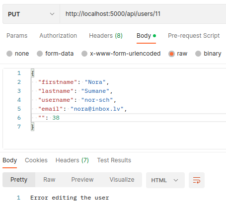

mkdir express_db_02 <br />
cd express_db_02 <br />
touch app.js <br />
npm init -y <br />
npm install express <br />
npm install nodemon --save-dev <br />
npm i dotenv <br />
npm i mysql2 <br />
npm run dev  <br />

*package.json*
```js
"main": "app.js",
  "scripts": {
    "start": "node app.js",
    "dev": "nodemon app.js",
    "test": "echo \"Error: no test specified\" && exit 1"
  }, ...
```

mysql> create database user; <br />
mysql> use user; <br />
mysql> create table users (id INT PRIMARY KEY AUTO_INCREMENT NOT NULL, firstname VARCHAR(80) NOT NULL, lastname VARCHAR(80) NOT NULL, username VARCHAR(12) NULL, email VARCHAR(125) NOT NULL, age INT NOT NULL); <br />
mysql> source ~/Documents/WILD/MySql/db-content-user.sql <br />

*db-content-user.sql*
```sql
INSERT INTO `user`.`users` (`firstname`, `lastname`, `username`, `email`, `age`) VALUES ('Leanne', 'Graham', 'Bret', 'Sincere@april.biz', 45);
INSERT INTO `user`.`users` (`firstname`, `lastname`, `username`, `email`, `age`) VALUES ('Ervin', 'Howell', 'Antonette', 'Shanna@melissa.tv', 36);
INSERT INTO `user`.`users` (`firstname`, `lastname`, `username`, `email`, `age`) VALUES ('Clementine', 'Bauch', 'Samantha', 'Nathan@yesenia.net', 55);
INSERT INTO `user`.`users` (`firstname`, `lastname`, `username`, `email`, `age`) VALUES ('Patricia', 'Lebsack', 'Karianne', 'Julianne.OConner@kory.org', 42);
INSERT INTO `user`.`users` (`firstname`, `lastname`, `username`, `email`, `age`) VALUES ('Chelsey', 'Dietrich', 'Kamren', 'Lucio_Hettinger@annie.ca', 49);
INSERT INTO `user`.`users` (`firstname`, `lastname`, `username`, `email`, `age`) VALUES ('Dennis', 'Schulist', 'Leopoldo', 'Karley_Dach@jasper.info', 56);
INSERT INTO `user`.`users` (`firstname`, `lastname`, `username`, `email`, `age`) VALUES ('Kurtis', 'Weissnat', 'Elwyn', 'Telly.Hoeger@billy.biz', 32);
INSERT INTO `user`.`users` (`firstname`, `lastname`, `username`, `email`, `age`) VALUES ('Nicholas', 'Runolfsdottir V', 'Maxime', 'Sherwood@rosamond.me', 21);
INSERT INTO `user`.`users` (`firstname`, `lastname`, `username`, `email`, `age`) VALUES ('Glenna', 'Reichert', 'Delphine', 'Chaim_McDermott@dana.io', 78);
INSERT INTO `user`.`users` (`firstname`, `lastname`, `username`, `email`, `age`) VALUES ('Clementina', 'DuBuque', 'Moriah', 'Rey.Padberg@karina.biz', 62);
```

# ROUTE POST




# ROUTE PUT


